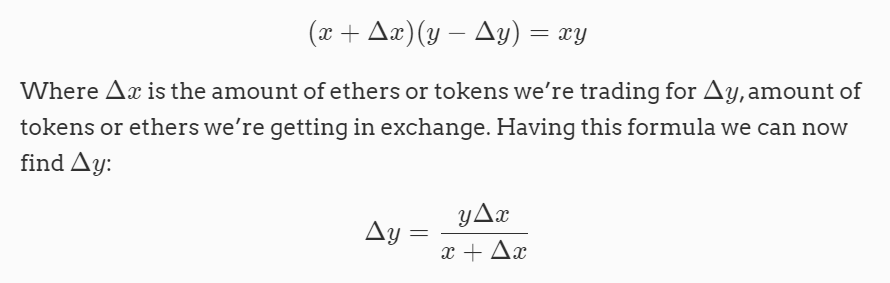

## Correct pricing function
  

* ```solidity
  function getAmount(
    uint256 inputAmount,
    uint256 inputReserve,
    uint256 outputReserve
  ) private pure returns (uint256) {
    require(inputReserve > 0 && outputReserve > 0, "invalid reserves");

    return (inputAmount * outputReserve) / (inputReserve + inputAmount);
  }
  ```

* ```solidity
  function getTokenAmount(uint256 _ethSold) public view returns (uint256) {
    require(_ethSold > 0, "ethSold is too small");

    uint256 tokenReserve = getReserve();

    return getAmount(_ethSold, address(this).balance, tokenReserve);
  }

  function getEthAmount(uint256 _tokenSold) public view returns (uint256) {
    require(_tokenSold > 0, "tokenSold is too small");

    uint256 tokenReserve = getReserve();

    return getAmount(_tokenSold, tokenReserve, address(this).balance);
  }
  ```

#### Link for codebase: https://github.com/Jeiwan/zuniswap.git
